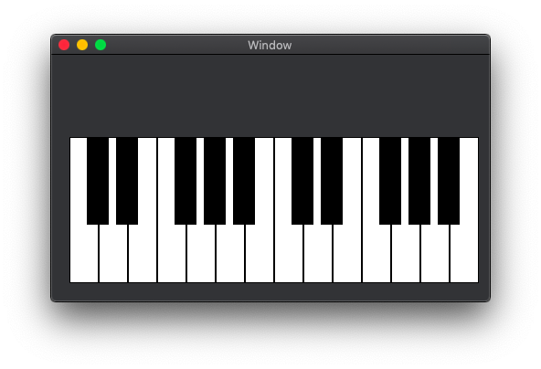

Pianoppoi
===
Play sound app written in Swift 5 with AudioToolBox

## Description
to study AudioToolBox MusicPlayer
The sound is play by PCPlay.swift

## Requirement
Swift 4.2 and 5.0

## Author
paraches
